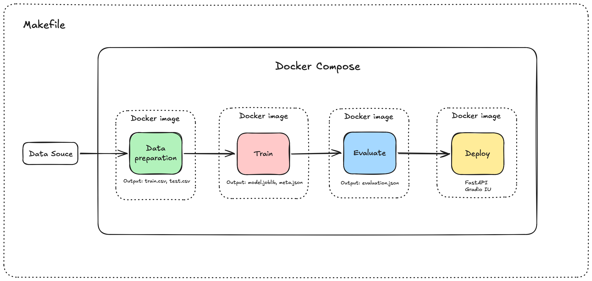
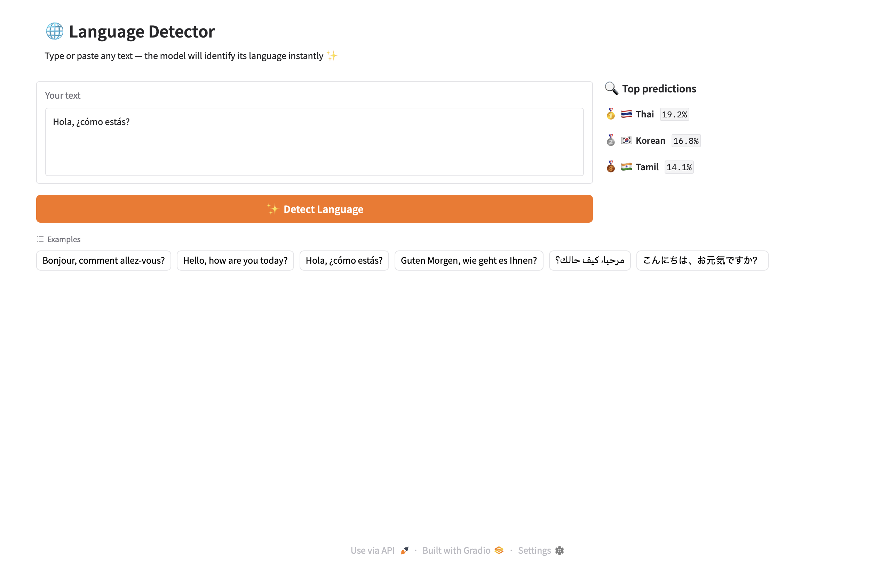

# 🌐 Language Detection Pipeline

A fully containerised ML pipeline that identifies the language of any text snippet.  
Built with **TF-IDF + Logistic Regression**, **FastAPI**, **Gradio**, and **Docker Compose**.

---

## Architecture


Data flows between steps via a **shared Docker volume** (`pipeline_data`).  
Each step writes a sentinel file (`.done`) so downstream steps can wait reliably.

## How to run the pipeline
### 1. Clone file
```bash
cd baonguyen-aumovio-homework
```

### 2. Build images
```bash
make build
```

### 3. Run the full pipeline
```bash
make run
```

### 4. Deploy
Deploy only
```bash
make deploy
```

### 5. Open app
```
http://localhost:8080/web
```

The app will look like this:


### 6. Stop 
```
make stop
```

---

## API Reference
Base URL: `http://localhost:8080`

### `GET /health`
Liveness probe.
```bash
make curl-health
```
```json
{"status": "ok", "num_languages": 22}
```

### `GET /languages`
List all supported languages.
```bash
make curl-languages
```

### `POST /predict`
Detect the language of a text snippet.
```bash
make curl-predict
```

## Running Tests

```bash
make test
```

---

## Experiment tracking
```bash
make mlflow
```

## Makefile Targets

| Target          | Description                                  |
|-----------------|----------------------------------------------|
| `make build`    | Build all Docker images                      |
| `make run`      | Run full pipeline + start API                |
| `make run-pipeline` | Run data-prep → train → evaluate only   |
| `make deploy`   | Start the API service only                |
| `make test`     | Run pytest suite                             |
| `make logs`     | Tail all container logs                      |
| `make clean`    | Remove containers, images, volumes, data     |
| `make curl-predict` | Smoke-test the `/predict` endpoint       |


